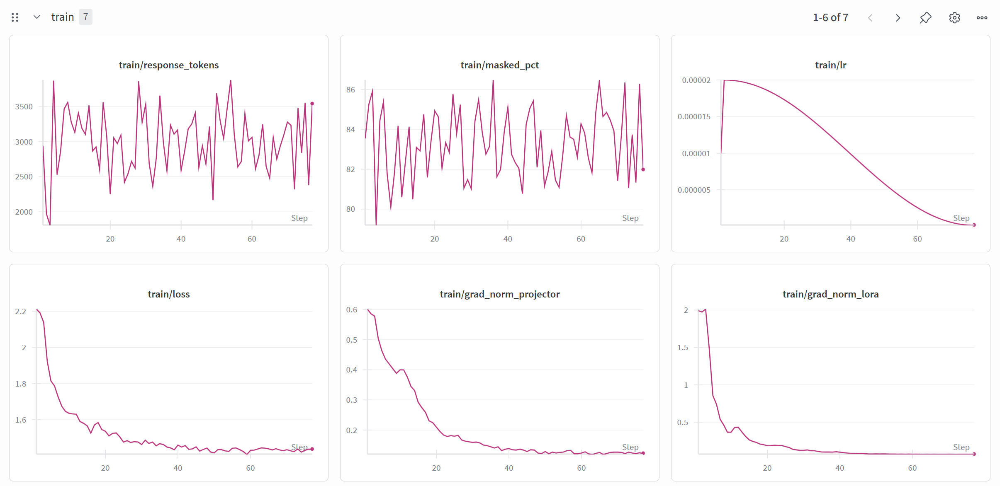
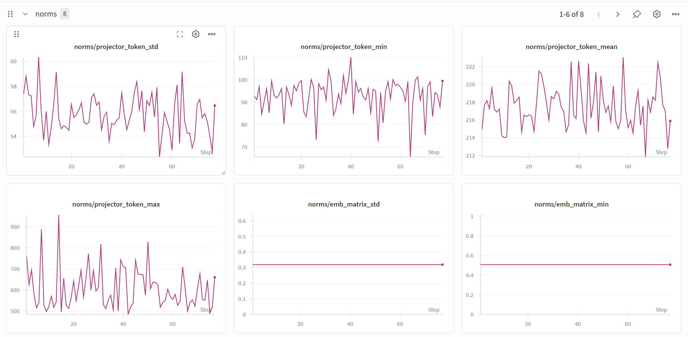
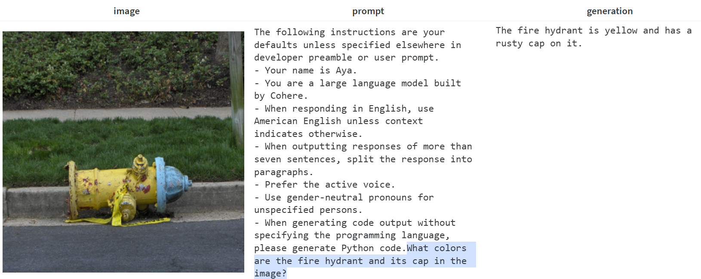
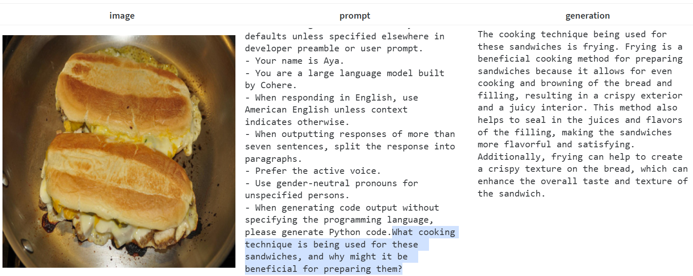
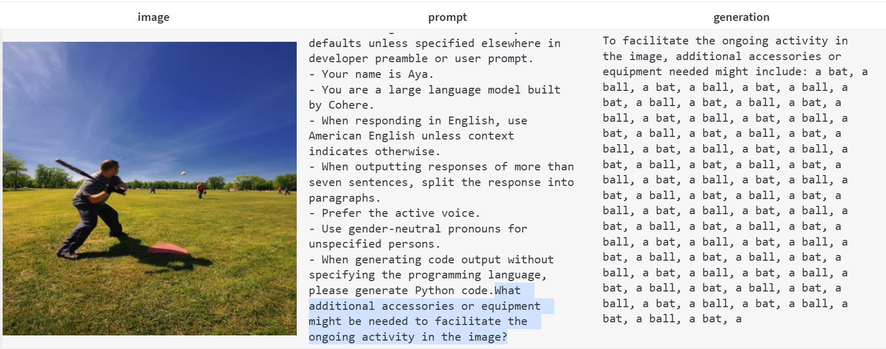
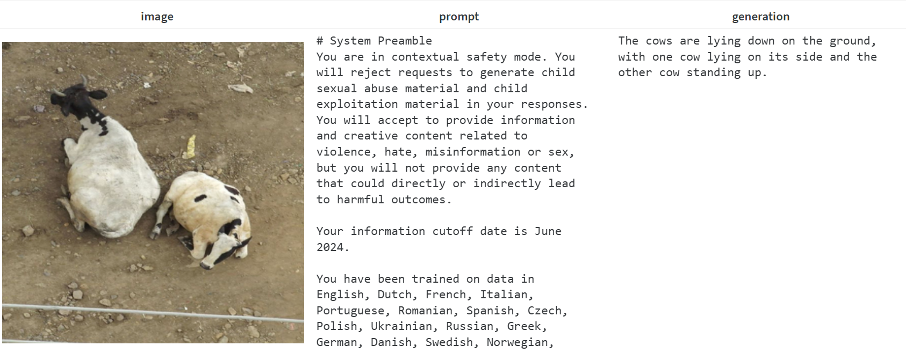

# Instruction Tuning Results (Phase 2)

## Overview

Phase 2 instruction-tunes the Tiny Aya Vision model on **LLaVA-Instruct-150K** (`liuhaotian/LLaVA-Instruct-150K`), building on the projector weights learned during Phase 1 alignment. The goal is to teach the model to follow conversational visual instructions — answering questions, describing images, and reasoning about visual content — while preserving the multilingual knowledge encoded in the LLM backbone.

### What is trained

| Component | Status |
|---|---|
| SigLIP2 vision encoder | Frozen |
| Multi-modal projector (Pixel Shuffle + SwiGLU MLP) | Trainable (initialised from Phase 1 checkpoint) |
| Tiny Aya LLM backbone (Tiny-Aya-Global) | LoRA adapters on upper layers (base weights frozen) |

### LoRA adapter configuration

LoRA adapters are injected into the **upper half** of the LLM (layers 18–35 of 36).

| Hyperparameter | Value |
|---|---|
| Rank | 256 |
| Alpha | 512 (effective scaling = 2.0) |
| Dropout | 0.05 |
| Bias | none |
| Target modules | `q_proj`, `k_proj`, `v_proj`, `o_proj`, `gate_proj`, `up_proj`, `down_proj` |
| Layers | 18–35 (upper half) |

### Training hyperparameters

| Hyperparameter | Value |
|---|---|
| Dataset | LLaVA-Instruct-150K |
| Epochs | 1 |
| Global batch size | 128 |
| Gradient accumulation steps | 32 |
| Learning rate | 2e-5 |
| LR scheduler | Cosine with linear warmup |
| Warmup ratio | 3% |
| Weight decay | 0.0 |
| Max gradient norm | 1.0 |
| Max sequence length | 2048 |
| Precision | bfloat16 |
| Seed | 42 |

---

## Training Curves

The training loss decreases steadily over the course of the run, with the cosine LR schedule driving convergence. Gradient norms are tracked separately for the projector and LoRA parameters.

---

## Projector and Embedding Norm Statistics

To monitor whether the projector output stays well-calibrated relative to the LLM's text embedding space, we track per-token L2 norms of the projector output alongside the LLM embedding matrix norms throughout training.

---

## Qualitative Results

### Successful generations

The model produces coherent, image-grounded responses that directly address the visual content and follow the conversational instruction format.

### Failure cases

Some generations exhibit hallucinated details, repetitive phrasing, or fail to accurately describe the image content — typical failure modes at this scale and training duration.

